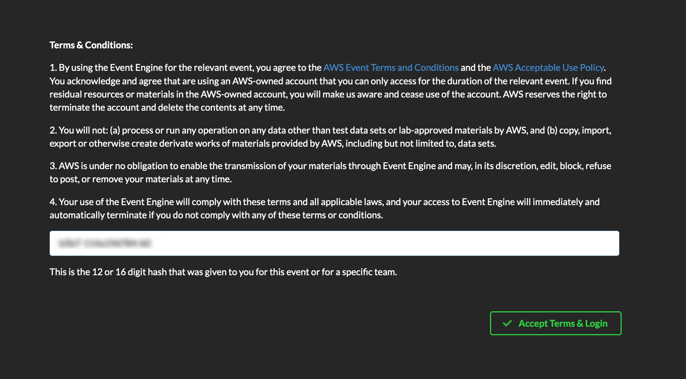
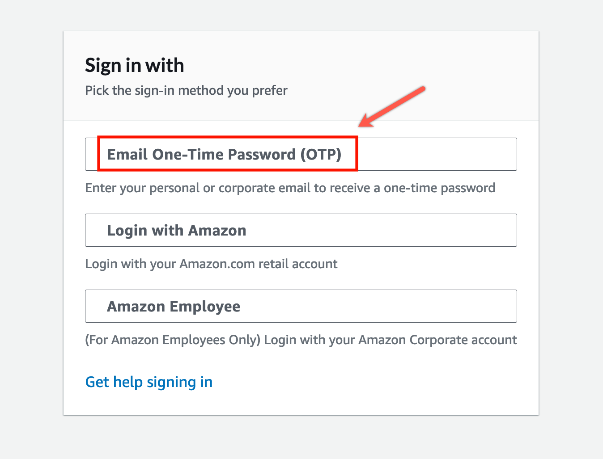
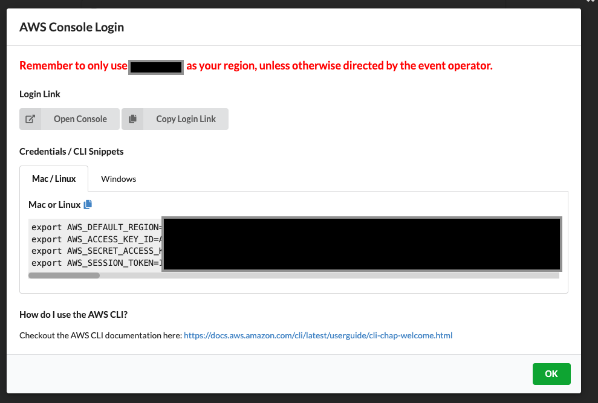
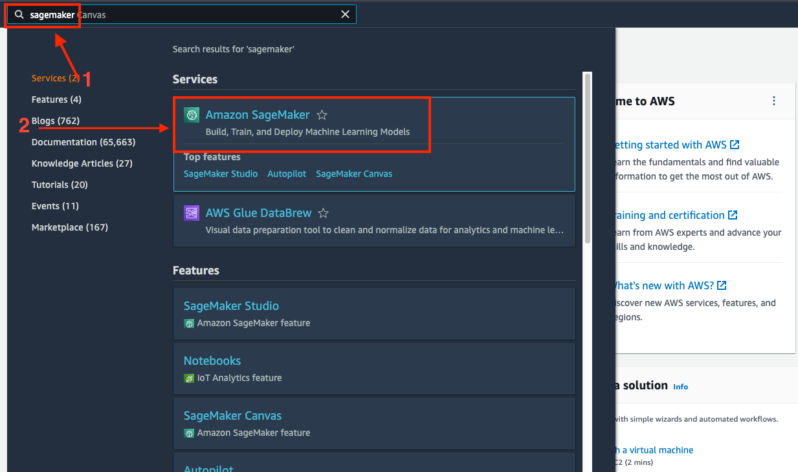
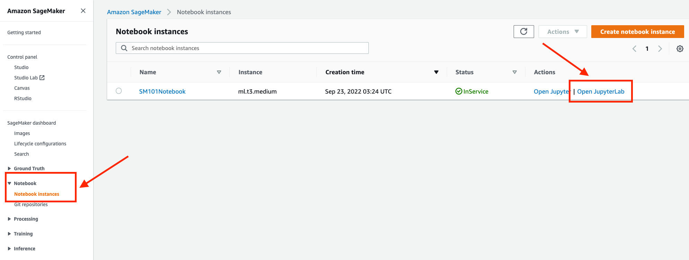
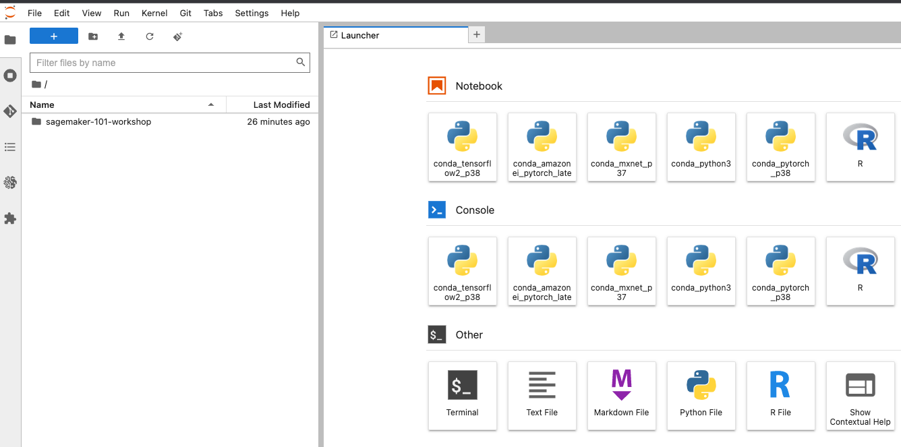
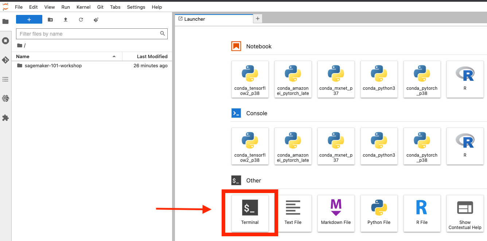

## Text and Images: Multimodal Learning on SageMaker

Welcome to the Text and Images: Multimodal Learning on SageMaker workshop. In this workshop we are going to cover: 

* Download and explore the dataset that contains text, images and tabular data.
* Train a miltimodal autoMM model using a Amazon SageMaker training job
* Perform batch inference using a Amazon SageMaker Processing job

# Getting Started

For this workshop you’ll get access to a temporary AWS Account already pre-configured with Amazon SageMaker Notebook Intances. Follow the steps in this section to login to your AWS Account and download the workshop material.

### 1. To get started navigate to - https://dashboard.eventengine.run/login 

Click on Accept Terms & Login

### 2. Click on Email One-Time OTP (Allow for up to 2 mins to receive the passcode)

### 3. Provide your email address

### 4. Enter your OTP code

### 5. Click on AWS Console

### 6. Click on Open AWS Console, remember to only use 'us-west-2' unless otherwise directed by event operator

### 7. In the AWS Console search for SageMaker and click on the Amazon SageMaker in the Services

### 8. Click on Amazon SageMaker Notebook -> Notebook Instances and then click on Open JupyterLab

### 9. You should now have Amazon SageMaker Notebook Jupyterlab interface open on your browser

### 10. Open a new terminal window

### 11. Clone the workshop content

In the terminal paste the following command to clone the workshop content repo:

`git clone https://github.com/aws-samples/sagemaker-multimodal-workshop.git`

### 12. Rejoin the presenter for a live walkthrough of the workshop

## Security

See [CONTRIBUTING](CONTRIBUTING.md#security-issue-notifications) for more information.

## License

This library is licensed under the MIT-0 License. See the LICENSE file.

